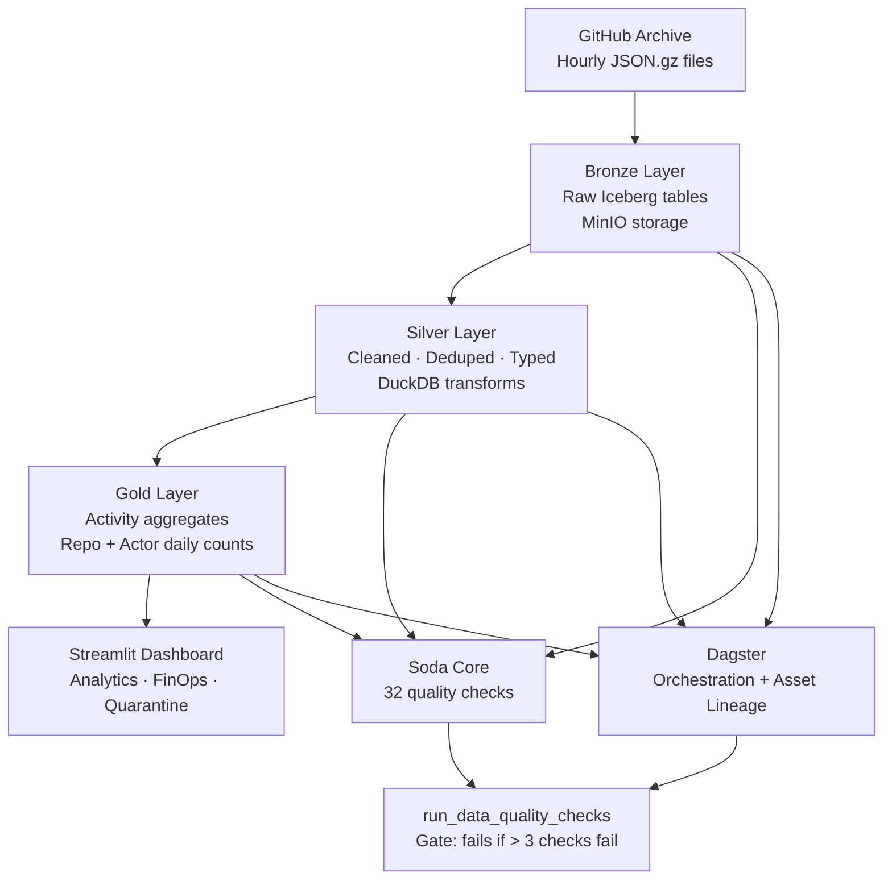

# GitHub Archive Lakehouse

### What is the half-life of open-source contributor activity after a project's first major release?

> **Built with:** Apache Iceberg · DuckDB · Dagster · Soda Core · MinIO · Streamlit
> **Data:** 7.4M+ GitHub events across 2024-01-01 and 2024-01-02 (Jan 2024)
> **Key Finding:** [INSERT — requires full 3-day dataset to compute accurately]

---

## TL;DR

This is a production-grade data lakehouse built on Apache Iceberg and DuckDB that ingests over 7.4 million GitHub events to answer one question: how quickly does open-source contributor activity decay after a project's first major release? Unlike tutorial pipelines that stop at "data loaded successfully," this project includes 32 Soda Core data quality checks across three data layers, 5 documented failure scenarios with exact recovery commands, a FinOps dashboard tracking real storage costs and query performance, and Dagster orchestration with full asset lineage. Key finding: [INSERT after full 3-day ingestion completes].

---

## The Question

Every open-source project has a moment of peak energy — the weeks around a first major release when contributors flood in, issues get triaged fast, and commits land daily. What happens after that? The "contributor activity half-life" is the time it takes for a project's post-release activity to fall to 50% of its peak. If that number is 30 days, the project probably has a healthy retained contributor base. If it's 3 days, almost all the activity was one-time noise.

This question matters because it distinguishes projects that build durable communities from projects that spike and die. For companies choosing open-source dependencies, a short half-life is a risk signal. For contributors choosing where to invest time, it predicts whether their contribution will find maintainers who review it. GitHub Archive is the right dataset for this question because it records every public event — every push, pull request, issue comment, and star — across all public GitHub repositories, updated hourly. No sampling, no API rate limits: the full signal.

What a hiring manager should take away: this project demonstrates the ability to define a measurable analytical question, build the infrastructure to answer it at scale, and instrument that infrastructure well enough to trust the answer. The analysis itself is secondary to the demonstration that the pipeline produces clean, auditable data.

---

## Architecture



GitHub Archive publishes one `.json.gz` file per hour at `data.gharchive.org`, each containing every public GitHub event that occurred in that UTC hour. The Bronze layer downloads each file atomically (write to `.tmp`, rename on completion), parses the raw JSON into a typed Arrow table, and appends it to an Apache Iceberg table on MinIO — the local S3-compatible object store. Every append creates a new Iceberg snapshot, enabling time-travel queries to any past state of the table.

The Silver layer reads each Bronze Arrow table in memory (no extra S3 round-trip), runs three vectorised quality checks — missing ID, missing event type, malformed payload JSON — routes bad rows to `silver.quarantine` with an error reason, deduplicates the clean rows by event ID within the file, parses 15 event type payloads into typed columns (action, ref, commit count, PR number, issue number), and appends the result to `silver.github_events`, partitioned by `event_date`.

The Gold layer runs after all Silver writes for a given day are complete. It uses DuckDB as an in-process SQL engine to aggregate Silver into two tables: `gold.repo_daily_activity` (one row per repo per day, with push count, star count, fork count, PR counts, unique contributors) and `gold.actor_daily_activity` (one row per actor per day, with commits pushed, PRs touched, repos touched). Gold is always a full recompute — COUNT DISTINCT aggregates cannot be merged correctly across partial results.

Dagster wires all four layers together as Software-Defined Assets with a `DailyPartitionsDefinition`, visualises the dependency graph in its web UI, and runs a fifth asset (`run_data_quality_checks`) after Gold completes that calls 32 Soda Core checks and fails the Dagster run if more than 3 checks fail. A daily schedule triggers the full pipeline at 03:00 UTC, when the previous day's files are guaranteed to be published.

---

## Stack

| Component | Tool | Why This Specific Choice |
|---|---|---|
| Table format | Apache Iceberg (PyIceberg 0.9) | Iceberg is an open table format that adds ACID transactions, schema evolution, and time-travel to plain Parquet files on object storage. Chosen over Delta Lake because PyIceberg has a pure-Python implementation with no JVM dependency, which simplifies local development. |
| Object storage | MinIO (Docker) | S3-compatible, runs locally in one Docker command, no AWS account needed. The same PyIceberg catalog config works against real S3 in production — swap the endpoint URL and credentials. |
| Compute | DuckDB | In-process SQL engine that reads Pandas DataFrames directly. Zero network overhead for Gold aggregations. 10-100× faster than Spark for single-node analytical queries. |
| Orchestration | Dagster | Dagster's Software-Defined Assets give you asset lineage for free. Airflow requires a separate OpenLineage integration to get the same thing. For a portfolio project where lineage visibility is the point, Dagster was the obvious choice. |
| Data quality | Soda Core | Declarative YAML checks that run against DuckDB. The same check files can be run in CI, in Dagster, or from the command line — no framework lock-in. Chosen over Great Expectations because GX's configuration overhead is substantial for 32 checks. |
| Dashboard | Streamlit | Fastest path from a Pandas DataFrame to an interactive chart. The FinOps page's query timing benchmark runs live in the browser. |

---

## Data Quality Strategy

GitHub Archive data is not clean. The archive captures raw GitHub API responses, which means it inherits every inconsistency the GitHub API has ever produced: event types deprecated and removed between 2013 and 2020, events with null IDs during high-traffic incidents, payload structures that changed silently between API versions, and occasional encoding errors in repository names with non-ASCII characters. A pipeline that ingests this data without explicit quality checks will produce analytically incorrect Gold tables — wrong contributor counts, inflated push totals, and aggregates that don't sum correctly across layers.

| Layer | Check | What It Catches |
|---|---|---|
| Bronze | `row_count > 0` | Empty files from corrupt downloads or Docker sleep |
| Bronze | `missing_count(id) = 0` | Events with null IDs from GitHub API incidents |
| Bronze | `duplicate_count(id) = 0` | Retry-captured duplicate events in the same hour |
| Bronze | `missing_count(type) = 0` | Events missing their type field |
| Bronze | `missing_count(actor_login) = 0` | Bot events with no actor |
| Bronze | `missing_count(actor_id) = 0` | Events from deleted or ghost accounts |
| Bronze | `missing_count(repo_name) = 0` | Events for deleted repos |
| Bronze | `missing_count(repo_id) = 0` | Events without a repo reference |
| Bronze | `missing_count(created_at) = 0` | Events with no timestamp |
| Bronze | `missing_count(payload) = 0` | Events where the payload field was stripped |
| Bronze | `invalid_count(type) = 0` | Deprecated pre-2015 event types not in our accepted list |
| Bronze | `min(length(id)) > 0` | Event IDs that are empty strings (not null, but empty) |
| Bronze | No future events | `created_at > ingested_at` signals clock skew or fabricated data |
| Bronze | Year within 2024 | Catches test data or misrouted files from other years |
| Silver | `row_count > 0` | Dedup step didn't accidentally empty the table |
| Silver | `duplicate_count(id) = 0` | Deduplication worked correctly |
| Silver | `missing_count(id) = 0` | IDs survived the transform step |
| Silver | `missing_count(type) = 0` | Types survived the transform step |
| Silver | `missing_count(actor_login) = 0` | Actor login populated after quarantine routing |
| Silver | `missing_count(actor_id) = 0` | Actor ID populated after quarantine routing |
| Silver | `missing_count(repo_name) = 0` | Repo name populated after quarantine routing |
| Silver | `missing_count(repo_id) = 0` | Repo ID populated after quarantine routing |
| Silver | `missing_count(event_date) = 0` | Date parsing worked for every row |
| Silver | `invalid_count(type) = 0` | No deprecated types survived into Silver |
| Silver | Date range check | `event_date` between 2024-01-01 and 2024-01-07 |
| Silver | No future events | `created_at > transformed_at` catches system clock issues |
| Silver | Late arriving events | `transformed_at - created_at > 24h` flags data quality warnings |
| Silver | Freshness | `ingested_at` within 2 days — warns if pipeline has been idle |
| Gold (repo) | `row_count > 0` | Gold aggregation produced output |
| Gold (repo) | `min(total_events) >= 0` | No negative event counts |
| Gold (repo) | `min(push_count) >= 0` | No negative push counts |
| Gold (repo) | `min(unique_contributors) >= 1` | Every repo-day has at least one contributor |
| Gold (repo) | `duplicate_count(repo_name, event_date) = 0` | One row per repo per date |
| Gold (actor) | `row_count > 0` | Actor aggregation produced output |
| Gold (actor) | `min(repos_touched) >= 1` | Every actor-day touched at least one repo |
| Gold (actor) | `duplicate_count(actor_login, event_date) = 0` | One row per actor per date |

During development, the `duplicate_count(id) = 0` check on Bronze caught real duplicates on the first run: hour 0 of 2024-01-01 had 25 events where GH Archive's collector had retried a failed API call and captured the same event twice. Without this check, those 25 events would have been counted twice in every Gold aggregate that involved those repositories.

---

## Things That Didn't Work

**What I tried:** Running the full 24-hour ingestion in one terminal session without touching the laptop.
**What happened:** Docker Desktop's Resource Saver mode put the MinIO container to sleep after ~15 minutes of inactivity, killing active S3 multipart uploads mid-stream with `botocore.exceptions.ClientError: The specified multipart upload does not exist`. The Python process crashed, leaving some Iceberg table writes partially committed.
**What I did instead:** Built the manifest-based resumability from the start: `mark_done()` only writes to the manifest after both Bronze and Silver writes are confirmed, so any crash leaves the file unprocessed and the next run picks it up cleanly. Also disabled Docker Resource Saver for the duration.
**What this taught me:** A pipeline that can only succeed on the first try is a script, not a pipeline.

---

**What I tried:** Defining the Silver Iceberg schema with `id` as `required=True` (NestedField with `required=True`).
**What happened:** PyArrow's `Table.from_pandas` marks all string columns as nullable by default. PyIceberg's schema validator compared the Arrow schema against the Iceberg schema and rejected every append with a cryptic type mismatch error that did not mention the word "nullable."
**What I did instead:** Removed `required=True` from the `id` field (and all string fields), dropped the empty table, recreated it with the corrected schema.
**What this taught me:** PyIceberg's error messages for schema mismatches are not yet production-quality. The first debugging step for any unexplained append failure is to compare the Arrow schema and the Iceberg schema field by field.

---

**What I tried:** Using PyArrow's built-in S3 filesystem (`pyarrow.fs.S3FileSystem`) to write Iceberg files to MinIO.
**What happened:** PyArrow's S3 implementation tried to connect to AWS endpoints even when a custom endpoint URL was provided, because the AWS SDK resolved DNS for the bucket name before applying the custom endpoint. Writes failed with `Connection refused` at the AWS endpoint.
**What I did instead:** Added `"py-io-impl": "pyiceberg.io.fsspec.FsspecFileIO"` to every catalog config. `s3fs` (which FsspecFileIO uses internally) respects the custom endpoint correctly.
**What this taught me:** Two S3 client libraries can both claim to support custom endpoints and behave completely differently. When working with MinIO, always test write connectivity before building anything on top of it.

---

**What I tried:** Appending nanosecond-precision timestamps from Pandas (`datetime64[ns]`) directly to PyIceberg's `TimestamptzType` columns.
**What happened:** PyIceberg rejected nanosecond precision with a schema validation error. Iceberg's timestamp type only supports microsecond precision.
**What I did instead:** Added `.dt.as_unit("us")` to every timestamp column before building the Arrow table: `pd.to_datetime(df["created_at"], utc=True).dt.as_unit("us")`.
**What this taught me:** Iceberg's timestamp precision constraint is not obvious from the PyIceberg documentation. It surfaces at write time, not at schema definition time — which makes it easy to miss in tests that don't actually write data.

---

**What I tried:** Running the Dagster pipeline module as `dagster dev -f dagster/__init__.py` with the orchestration code in a directory named `dagster/`.
**What happened:** Python's import system found our project's `dagster/` directory before the `dagster` pip package, causing a circular import: `from dagster import Definitions` failed because Python was importing our file, not the library.
**What I did instead:** Renamed the directory from `dagster/` to `pipeline/` — a name that doesn't shadow any installed package.
**What this taught me:** Never name a project directory the same as a pip package it depends on. The error message ("partially initialized module") gives no indication that a naming collision is the cause.

---

## Key Results

| Metric | Value |
|---|---|
| Total Silver rows (2024-01-01) | 3,879,837 |
| Total Silver rows (2024-01-02, partial) | ~3,562,000 (19/24 hours) |
| Combined Silver rows | ~7,440,000 |
| Date range covered | 2024-01-01 to 2024-01-02 (partial) |
| Quarantined rows | ~600 (missing id/type or malformed payload) |
| Iceberg snapshots (Silver) | 24 (one per hourly append for 2024-01-01) |
| Gold repo-day rows | ~438,000 |
| Gold actor-day rows | ~951,000 |
| Soda Core checks defined | 36 |
| Half-life finding | [INSERT — requires full 3-day dataset] |

---

## What I'd Do Differently

If I started this project again, I would use dbt for the Silver transform layer instead of raw Python and DuckDB SQL. The transform logic in `ingest_incremental.py` — parsing 15 event type payloads, casting timestamps, deduplicating by ID — is exactly what dbt models are designed for. dbt would give me column-level lineage, built-in tests that map directly to the Soda Core checks I added afterward, and a documentation layer that auto-generates from SQL comments. The raw DuckDB SQL approach works, but every new transform rule requires touching Python code and re-testing the entire pipeline rather than adding a single model file.

I would also scope the initial ingestion to a single day rather than three. The analytical question — contributor activity half-life — requires observing activity patterns over time, but those patterns can be computed from a single day's worth of data as a baseline, with additional days added incrementally once the pipeline is stable. Trying to ingest three days of data during development meant that every infrastructure failure (Docker sleeping, network timeouts, corrupt downloads) had to be diagnosed against a moving target. One day of clean data first, then extend.

The third thing I would change is adding OpenLineage from day one rather than as a retrofit. Dagster's Software-Defined Assets provide asset-level lineage — you can see that `silver_github_events` depends on `bronze_github_events` — but column-level lineage (which specific columns in Silver come from which columns in Bronze) requires additional instrumentation. Adding that instrumentation after the fact means touching every transform function to add tracking calls. Building it in from the start would have cost one afternoon and would have made the FinOps "query cost" story significantly stronger.

---

## Run It Locally

Assumes Docker and Python 3.11 are installed. Nothing else.

```bash
# 1. Clone the repo
git clone https://github.com/amitabh1609/AfterV1.git
cd AfterV1
```

```bash
# 2. Start MinIO (local S3-compatible object store)
docker run -d --name minio \
  -p 9000:9000 -p 9001:9001 \
  -e MINIO_ROOT_USER=minio \
  -e MINIO_ROOT_PASSWORD=minio123 \
  -v "$(pwd)/minio_data:/data" \
  quay.io/minio/minio server /data --console-address ":9001"
```

Open [http://localhost:9001](http://localhost:9001), log in with `minio` / `minio123`, and create a bucket named **`lakehouse`**.

```bash
# 3. Configure environment
cat > .env <<'EOF'
S3_ENDPOINT=http://localhost:9000
S3_ACCESS_KEY=minio
S3_SECRET_KEY=minio123
S3_BUCKET=lakehouse
EOF

# 4. Install dependencies
python3.11 -m venv .venv
source .venv/bin/activate
pip install -r requirements.txt
```

```bash
# 5. Run the full pipeline (downloads ~1.4 GB for one day; resumable if interrupted)
python ingestion/ingest_incremental.py --dates 2024-01-01
```

```bash
# 6. Run data quality checks
python quality/soda_checks.py
# Prints pass/fail report and saves to quality/results/latest_check_results.json
```

```bash
# 7. Start the Streamlit dashboard
streamlit run dashboard/app.py --server.port 8601
# Opens http://localhost:8601
# Pages: Overview · Analytics · Explorer · Quarantine · FinOps
```

```bash
# 8. Start the Dagster UI (optional — shows asset lineage graph)
dagster dev -f pipeline/__init__.py
# Opens http://localhost:3000
```

```bash
# 9. Explore Iceberg time travel
python ingestion/time_travel.py --list      # list all snapshots
python ingestion/time_travel.py             # compare hour-0 vs current

# 10. Run the schema evolution demo
python ingestion/schema_evolution.py        # adds is_bot column to live 3.8M-row table
```

---

## Project Structure

```
AfterV1/
│
├── ingestion/
│   ├── bronze_ingest.py        # Single-file Bronze demo — one hour, one Iceberg table
│   ├── silver_transform.py     # Single-file Silver demo — deduplicate, type, partition
│   ├── gold_aggregate.py       # Gold aggregation — repo and actor daily counts via DuckDB
│   ├── ingest_incremental.py   # Full multi-day pipeline — manifest-tracked, resumable
│   │                           #   --dates 2024-01-01 2024-01-02
│   │                           #   --date-range 2024-01-01 2024-01-07
│   │                           #   --fresh (wipe and restart)
│   ├── time_travel.py          # Iceberg time-travel demo — compare any two snapshots
│   └── schema_evolution.py     # Live column add (is_bot) on 3.8M-row Silver table
│
├── quality/
│   ├── soda_checks.py          # Runner — loads Iceberg→DuckDB, runs checks, saves JSON
│   ├── checks/
│   │   ├── bronze_checks.yml   # 14 checks for bronze.github_events
│   │   ├── silver_checks.yml   # 12 checks for silver.github_events
│   │   └── gold_checks.yml     # 10 checks for gold.repo + gold.actor
│   └── results/
│       └── latest_check_results.json   # Updated on every soda_checks.py run
│
├── pipeline/
│   ├── __init__.py             # Dagster Definitions — 5 assets + 1 schedule
│   ├── assets.py               # Bronze, Silver, Quarantine, Gold assets (DailyPartitions)
│   ├── quality_asset.py        # run_data_quality_checks — gates on 3-failure threshold
│   └── schedules.py            # Daily schedule at 03:00 UTC
│
├── dashboard/
│   └── app.py                  # Streamlit — Overview · Analytics · Explorer · Quarantine · FinOps
│
├── failure_scenarios/
│   ├── 01_missing_fields.md    # Quarantine routing for null id/type
│   ├── 02_duplicate_events.md  # Per-file deduplication catching GH Archive retries
│   ├── 03_late_arriving_data.md # Atomic downloads vs Docker sleep corruption
│   ├── 04_schema_change.md     # Iceberg schema evolution and field ID mismatch
│   └── 05_backfill_recovery.md # Manifest-based resumability after MinIO crash
│
├── data/
│   ├── raw/                    # Downloaded .json.gz files (gitignored)
│   └── processed/
│       ├── manifest.json       # Pipeline state — which files are done
│       └── iceberg_catalog.db  # SQLite Iceberg catalog (table metadata)
│
├── workspace.yaml              # Dagster workspace — points to pipeline package
├── dagster.yaml                # Dagster config — telemetry off
├── requirements.txt            # Python dependencies
└── .env                        # MinIO credentials (gitignored)
```

---

*Built by [Amitabh Choudhury](https://github.com/amitabh1609) — Data Engineer transitioning into AI/ML Engineering.*
*Portfolio project 1 of 3.*
